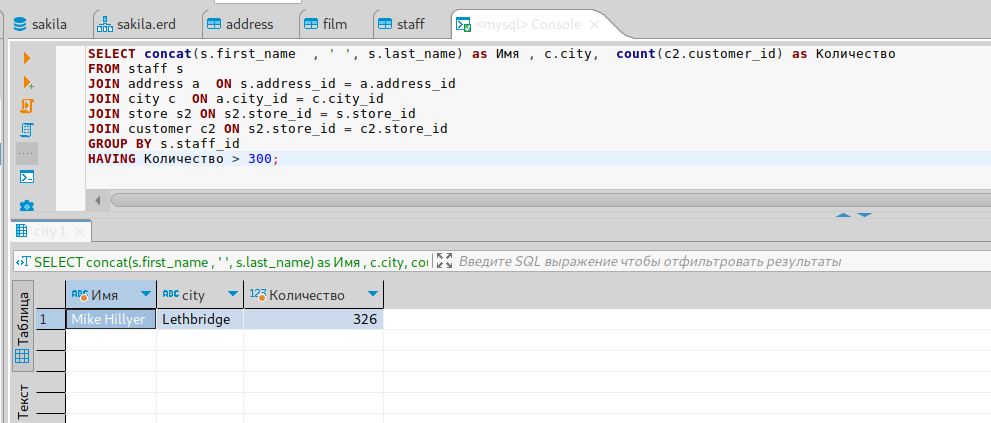
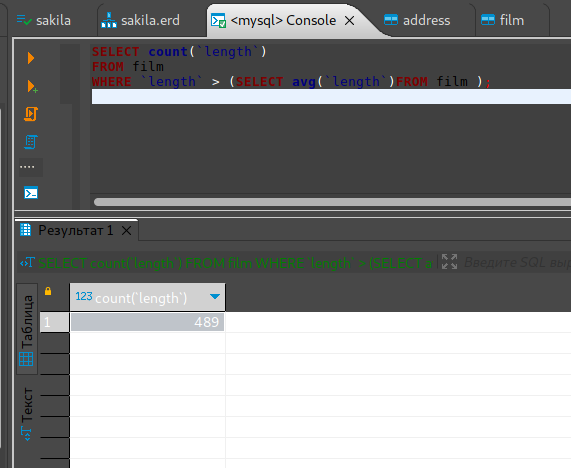
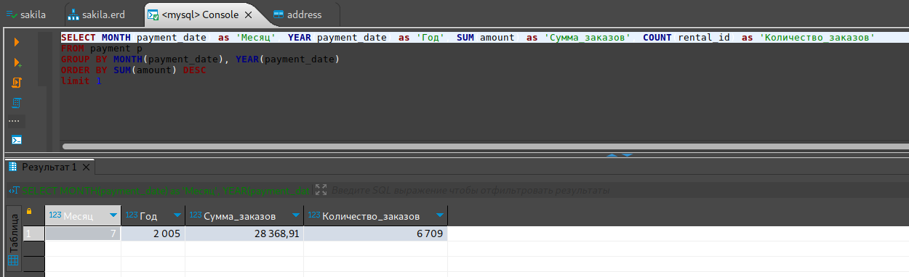

# Домашнее задание к занятию "`12.4. «SQL. Часть 2»`" - `Живарев Игорь`

### Задание 1

`Одним запросом получаем информацию о магазине, в котором обслуживается более 300 покупателей:`

```
SELECT concat(s.first_name  , ' ', s.last_name) as Имя , c.city,  count(c2.customer_id) as Количество 
FROM staff s 
JOIN address a  ON s.address_id = a.address_id 
JOIN city c  ON a.city_id = c.city_id 
JOIN store s2 ON s2.store_id = s.store_id 
JOIN customer c2 ON s2.store_id = c2.store_id 
GROUP BY s.staff_id 
HAVING Количество > 300;
```




---

### Задание 2

`Количество фильмов, продолжительность которых больше средней продолжительности всех фильмов:`

```
SELECT count(`length`) 
FROM film 
WHERE `length` > (SELECT avg(`length`)FROM film );
```




---

### Задание 3

`Получение информации, за какой месяц была получена наибольшая сумма платежей:`

```
SELECT MONTH(payment_date) as 'Месяц', YEAR(payment_date) as 'Год', SUM(amount) as 'Сумма_заказов', COUNT(rental_id) as 'Количество_заказов'
FROM payment p
GROUP BY MONTH(payment_date), YEAR(payment_date)
ORDER BY SUM(amount) DESC
limit 1;
```
